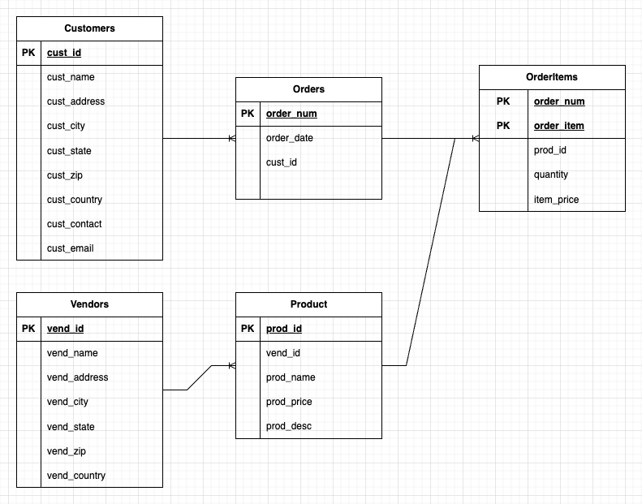

# 《SQL 必知必会》



## 检索数据

### 检索单个列
```sql
mysql> select prod_name from products;
+---------------------+
| prod_name           |
+---------------------+
| Fish bean bag toy   |
| Bird bean bag toy   |
| Rabbit bean bag toy |
| 8 inch teddy bear   |
| 12 inch teddy bear  |
| 18 inch teddy bear  |
| Raggedy Ann         |
| King doll           |
| Queen doll          |
+---------------------+
9 rows in set (0.00 sec)
```

### 检索多个列
```sql
mysql> select prod_id, prod_name, prod_price
    -> from products;
+---------+---------------------+------------+
| prod_id | prod_name           | prod_price |
+---------+---------------------+------------+
| BNBG01  | Fish bean bag toy   |       3.49 |
| BNBG02  | Bird bean bag toy   |       3.49 |
| BNBG03  | Rabbit bean bag toy |       3.49 |
| BR01    | 8 inch teddy bear   |       5.99 |
| BR02    | 12 inch teddy bear  |       8.99 |
| BR03    | 18 inch teddy bear  |      11.99 |
| RGAN01  | Raggedy Ann         |       4.99 |
| RYL01   | King doll           |       9.49 |
| RYL02   | Queen doll          |       9.49 |
+---------+---------------------+------------+
9 rows in set (0.00 sec)

```

### 检索所有列
```sql
mysql> select * from products;
+---------+---------+---------------------+------------+-----------------------------------------------------------------------+
| prod_id | vend_id | prod_name           | prod_price | prod_desc                                                             |
+---------+---------+---------------------+------------+-----------------------------------------------------------------------+
| BNBG01  | DLL01   | Fish bean bag toy   |       3.49 | Fish bean bag toy, complete with bean bag worms with which to feed it |
| BNBG02  | DLL01   | Bird bean bag toy   |       3.49 | Bird bean bag toy, eggs are not included                              |
| BNBG03  | DLL01   | Rabbit bean bag toy |       3.49 | Rabbit bean bag toy, comes with bean bag carrots                      |
| BR01    | BRS01   | 8 inch teddy bear   |       5.99 | 8 inch teddy bear, comes with cap and jacket                          |
| BR02    | BRS01   | 12 inch teddy bear  |       8.99 | 12 inch teddy bear, comes with cap and jacket                         |
| BR03    | BRS01   | 18 inch teddy bear  |      11.99 | 18 inch teddy bear, comes with cap and jacket                         |
| RGAN01  | DLL01   | Raggedy Ann         |       4.99 | 18 inch Raggedy Ann doll                                              |
| RYL01   | FNG01   | King doll           |       9.49 | 12 inch king doll with royal garments and crown                       |
| RYL02   | FNG01   | Queen doll          |       9.49 | 12 inch queen doll with royal garments and crown                      |
+---------+---------+---------------------+------------+-----------------------------------------------------------------------+
9 rows in set (0.00 sec)
```

### 检索不同的值
```sql
mysql> select vend_id from products;
+---------+
| vend_id |
+---------+
| BRS01   |
| BRS01   |
| BRS01   |
| DLL01   |
| DLL01   |
| DLL01   |
| DLL01   |
| FNG01   |
| FNG01   |
+---------+
9 rows in set (0.00 sec)

mysql> select distinct vend_id from products;
+---------+
| vend_id |
+---------+
| BRS01   |
| DLL01   |
| FNG01   |
+---------+
3 rows in set (0.00 sec)
```

### 限制结果
```sql
mysql> select prod_name from products limit 5;
+---------------------+
| prod_name           |
+---------------------+
| Fish bean bag toy   |
| Bird bean bag toy   |
| Rabbit bean bag toy |
| 8 inch teddy bear   |
| 12 inch teddy bear  |
+---------------------+
5 rows in set (0.00 sec)

mysql> select prod_name from products limit 5 offset 5;
+--------------------+
| prod_name          |
+--------------------+
| 18 inch teddy bear |
| Raggedy Ann        |
| King doll          |
| Queen doll         |
+--------------------+
4 rows in set (0.01 sec)
```

### 使用注释
```sql
select prod_name     -- 这是一条注释
from products;


# 这是一条注释
select prod_name     
from products;


/* select prod_name, vend_id
   from products;
*/
select prod_name
from products;
```

### 资源
[Sams Teach Yourself SQL in 10 Minutes](https://forta.com/books/0135182794/)
[10 Best UML Diagram Software Tools in 2024](https://clickup.com/blog/uml-diagram-software/?utm_source=google-pmax&utm_medium=cpc&utm_campaign=gpm_cpc_ar_nnc_pro_trial_all-devices_tcpa_lp_x_all-departments_x_pmax&utm_content=&utm_creative=_____&gad_source=1&gclid=CjwKCAjwz42xBhB9EiwA48pT76ag9XqDHJmZQGdsLmJn_KnKQVz8ZXNdcj_sExTpyqzzu3A5aH2NdRoCKz4QAvD_BwE)